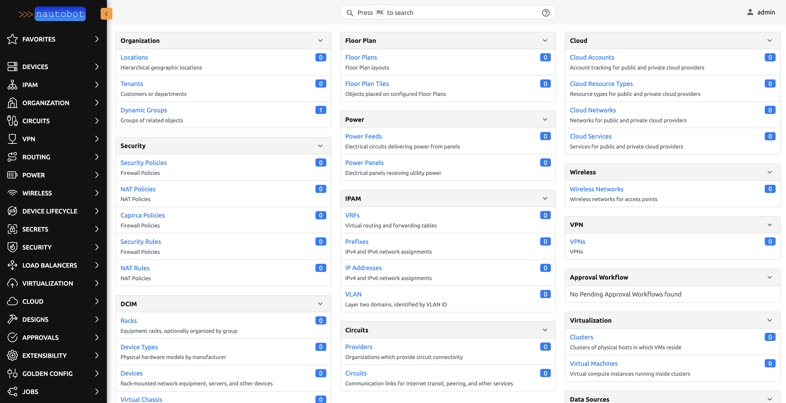
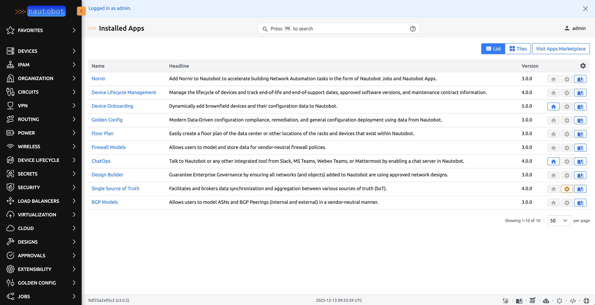
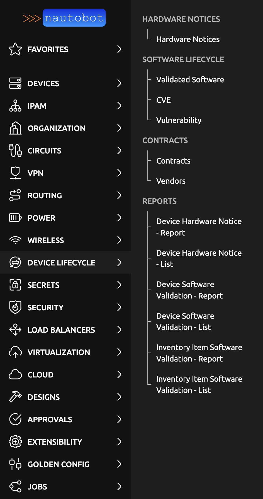
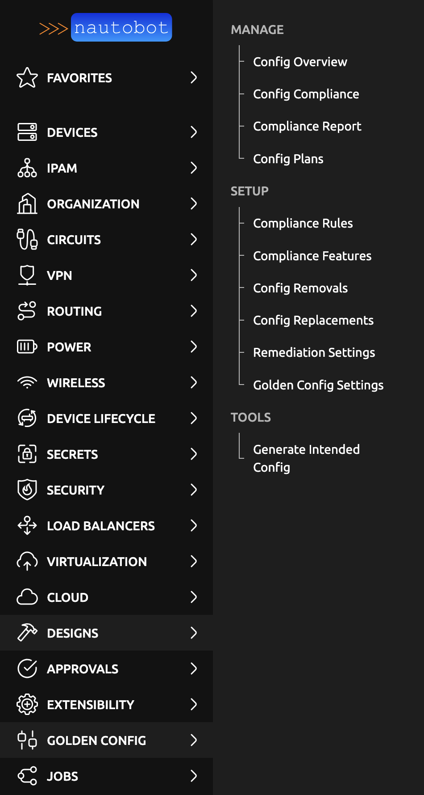
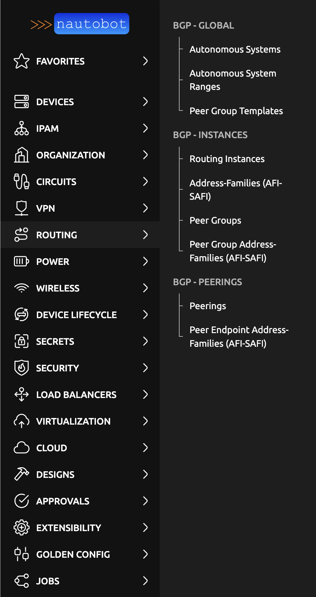
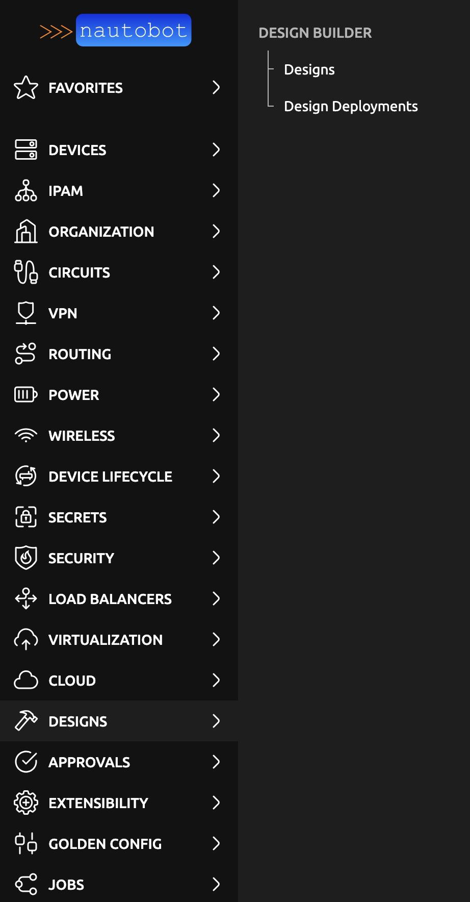
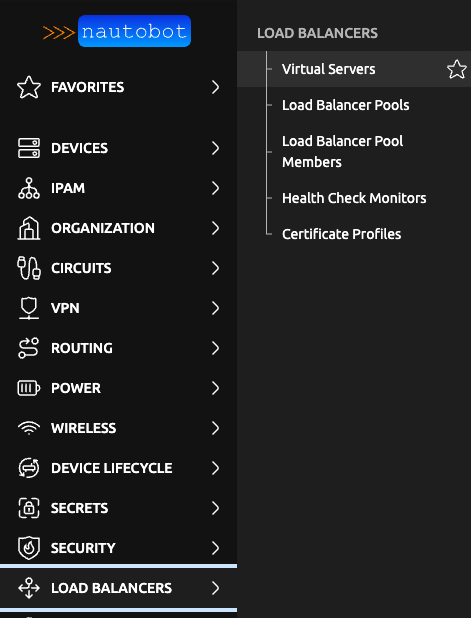

# Nautobot Test/Dev Setup

This repository provides a **quick startup solution** for running Nautobot in a test or development environment. The setup includes **most of the free Nautobot apps** pre-installed and pre-configured, making it easy to get started with a fully-featured Nautobot instance without the hassle of manual plugin installation and configuration.

The setup uses the `bsmeding/nautobot` Docker image which includes many pre-installed plugins, and comes with a pre-configured `nautobot_config.py` file that enables all available apps out of the box.



## Overview of Installed Apps

The following image shows the Nautobot interface with all installed apps visible in the navigation menu:



## Installed Nautobot Apps

The following free Nautobot apps are pre-installed and ready to use:

### Device Lifecycle Management


### Golden Configuration


### BGP Models


### Firewall Models


### Design Builder


### VPNs


### Loadbalancers


### Additional Installed Apps

In addition to the apps shown above, the following apps are also pre-installed and available:

- **Nornir Plugin** - Network automation framework integration
- **Single Source of Truth (SSOT)** - Data synchronization with external systems
- **Device Onboarding** - Automated device onboarding workflows
- **Floor Plan** - Rack and floor plan visualization
- **ChatOps** - Chat platform integrations (Slack, Webex, Teams, etc.)
- **Secrets Providers** - Integration with secrets management systems (Vault, AWS Secrets Manager, etc.)

All apps are pre-configured and ready to enable in the Nautobot configuration file.

## Getting Started

```bash
# 1. Clone the repository
git clone https://github.com/bsmeding/nautobot_docker_compose
cd nautobot_docker_compose

# 2. (Optional) Edit .env file to customize settings
# The .env file is included with sensible defaults

# 3. Start the stack
docker compose up -d
```

That's it! Access Nautobot at http://localhost:8081 (default credentials: `admin` / `admin`)

The configuration file is already included and pre-configured with all plugins enabled, so you can start using Nautobot immediately.

## Overview

This setup includes:
- **Nautobot** - Network Source of Truth and automation platform
- **PostgreSQL** - Database backend
- **Redis** - Caching and Celery message broker
- **Celery Beat** - Scheduled task scheduler
- **Celery Worker** - Background task processor

All services are configured via environment variables in a `.env` file, making it easy to customize for different environments.

## Prerequisites

- Docker and Docker Compose installed
- At least 4GB of available RAM
- Ports 8081 (Nautobot) and 6380 (Redis) available (configurable)

### Getting a Fresh/Plain Configuration File

If you want to start with a clean/default configuration file (without plugins pre-configured), you can regenerate it:

```bash
rm ./config/nautobot_config.py
bash get_config.sh
```

**Note:** The `get_config.sh` script **only works with the `bsmeding/nautobot` Docker image**, not with the default `networktocode/nautobot` image. The script uses `bsmeding/nautobot:3.0.2` which includes pre-installed plugins.

## Configuration

### Nautobot Configuration File

The `./config/nautobot_config.py` file is included in the repository and is **pre-configured with all available plugins enabled**. This configuration is generated from the `bsmeding/nautobot` Docker image which includes pre-installed plugins.

**Important Notes:**
- The `get_config.sh` script **only works with the `bsmeding/nautobot` Docker image**, not with the default `networktocode/nautobot` image. The script uses `bsmeding/nautobot:3.0.2` which includes all plugins pre-installed.
- If you want a plain/default configuration file (without plugins pre-configured), remove the current config file and rerun the script:
  ```bash
  rm ./config/nautobot_config.py
  bash get_config.sh
  ```
- The pre-configured file includes all plugins in the `PLUGINS` list and `PLUGINS_CONFIG` with recommended settings, making it ready to use out of the box.

### Environment Variables (.env file)

The `.env` file is included in the repository with sensible defaults. All configuration is managed through this file. Key variables include:

#### Container Configuration
- `CONTAINER_SUFFIX` - Suffix applied to all container names (default: `nautobotv3`)
- `NAUTOBOT_IMAGE` - Docker image to use (default: `bsmeding/nautobot:3.0.2`)

#### Ports
- `NAUTOBOT_PORT` - Port for Nautobot web UI (default: `8081`)
- `REDIS_PORT` - Port for Redis (default: `6380`)

#### Database
- `POSTGRES_USER` - PostgreSQL username (default: `nautobot`)
- `POSTGRES_PASSWORD` - PostgreSQL password (default: `nautobotpassword`)
- `POSTGRES_DB` - Database name (default: `nautobot`)

#### Superuser
- `SUPERUSER_NAME` - Initial admin username (default: `admin`)
- `SUPERUSER_PASSWORD` - Initial admin password (default: `admin`)
- `SUPERUSER_API_TOKEN` - API token for the superuser

#### Nautobot Settings
- `NAUTOBOT_DEBUG` - Enable debug mode (default: `True` for dev)
- `NAUTOBOT_LOG_LEVEL` - Logging level (default: `WARNING`)
- `NAUTOBOT_ALLOWED_HOSTS` - Allowed hostnames (default: `*`)
◊
See the `.env` file for all available configuration options.

### Version Management

The Nautobot version is controlled by the `NAUTOBOT_IMAGE` variable in `.env`. Currently configured for **Nautobot 3.x**, but can be adjusted:

```bash
# For Nautobot 3.x
NAUTOBOT_IMAGE=bsmeding/nautobot:3.0.2

# For Nautobot 2.x
NAUTOBOT_IMAGE=bsmeding/nautobot:2.4.19

# For Nautobot 1.x
NAUTOBOT_IMAGE=bsmeding/nautobot:1.6.32
```

**Note:** Different Nautobot versions may have different plugin compatibility. See the [Docker image documentation](https://github.com/bsmeding/docker_container_nautobot) for details.

## Available Plugins

The `bsmeding/nautobot` image includes the following plugins pre-installed (for Nautobot 3.x):

| Plugin | Description |
|--------|-------------|
| `nautobot-plugin-nornir` | Nornir integration for network automation |
| `nautobot-device-lifecycle-mgmt` | Device lifecycle management |
| `nautobot-ssot[all]` | Single Source of Truth integrations |
| `nautobot-bgp-models` | BGP modeling and management |
| `nautobot-device-onboarding` | Automated device onboarding |
| `nautobot-golden-config` | Golden configuration management |
| `nautobot-floor-plan` | Floor plan visualization |
| `nautobot-firewall-models` | Firewall rule modeling |
| `nautobot-chatops` | ChatOps integration |
| `nautobot-design-builder` | Network design builder |
| `nautobot-secrets-providers` | Secrets management providers |

**Note:** 
- `nautobot-ui-plugin` is available but not included by default due to compatibility considerations.
- For the latest plugin versions, see the [Docker Hub repository](https://hub.docker.com/r/bsmeding/nautobot) or the [Docker image documentation](https://github.com/bsmeding/docker_container_nautobot).

## Enabling Plugins

To enable plugins, edit `./config/nautobot_config.py` and add them to the `PLUGINS` list. Some plugins may require additional configuration in `PLUGINS_CONFIG`. Refer to each plugin's documentation for detailed setup instructions.

### Drop-in Configuration: Enable All Plugins

Copy and paste this configuration into your `./config/nautobot_config.py` file to enable all available plugins with recommended settings:

```yaml
# Enable all available plugins
PLUGINS = [
    "nautobot_plugin_nornir",
    "nautobot_device_lifecycle_mgmt",
    "nautobot_ssot",
    "nautobot_bgp_models",
    "nautobot_device_onboarding",
    "nautobot_golden_config",
    "nautobot_floor_plan",
    "nautobot_firewall_models",
    "nautobot_chatops",
    "nautobot_design_builder",
    "nautobot_secrets_providers",
]

```

Config per plugin (optional):
```yaml
# Plugin configuration for all plugins (optional)
PLUGINS_CONFIG = {
    "nautobot_plugin_nornir": {
        "use_config_context": {"secrets": False, "connection_options": True},
        "connection_options": {
            "napalm": {
                "extras": {
                    "optional_args": {
                        "global_delay_factor": 1,
                    },
                },
            },
            "netmiko": {
                "extras": {
                    "global_delay_factor": 1,
                },
            },
        },
        "nornir_settings": {
            "credentials": "nautobot_plugin_nornir.plugins.credentials.env_vars.CredentialsEnvVars",
            "runner": {
                "plugin": "threaded",
                "options": {
                    "num_workers": 20,
                },
            },
        },
    },
    "nautobot_device_lifecycle_mgmt": {
        "enable_software": True,
        "enable_hardware": True,
        "enable_contract": True,
        "enable_provider": True,
        "enable_cve": True,
        "enable_software_image": True,
    },
    "nautobot_ssot": {
        # SSOT plugin typically doesn't require configuration here
        # Configure individual sync jobs through the UI
    },
    "nautobot_bgp_models": {
        # BGP Models plugin typically doesn't require configuration
    },
    "nautobot_device_onboarding": {
        "default_ip_status": "Active",
        "default_device_role": "onboarding",
        "skip_device_type_on_update": True,
    },
    "nautobot_golden_config": {
        "enable_backup": True,
        "enable_compliance": True,
        "enable_intended": True,
        "enable_sotagg": True,
        "sot_agg_transposer": "nautobot_golden_config.transposers.SoTaggTransposer",
        "backup_repository": "backup_repo",
        "intended_repository": "intended_repo",
        "jinja_repository": "jinja_repo",
        "jinja_path_template": "templates/{{ obj.platform.slug }}/{{ obj.platform.slug }}.j2",
        "backup_path_template": "backup/{{ obj.platform.slug }}/{{ obj.name }}.cfg",
        "intended_path_template": "intended/{{ obj.platform.slug }}/{{ obj.name }}.cfg",
        "backup_test_connectivity": False,
    },
    "nautobot_floor_plan": {
        # Floor Plan plugin typically doesn't require configuration
    },
    "nautobot_firewall_models": {
        # Firewall Models plugin typically doesn't require configuration
    },
    "nautobot_chatops": {
        # ChatOps plugin requires at least one platform integration
        # The Docker image includes nautobot-chatops[all] which installs all platform integrations
        # Configure specific platforms (Slack, Microsoft Teams, Ansible, Grafana, etc.) through the UI
    },
    "nautobot_design_builder": {
        # Design Builder plugin typically doesn't require configuration
    },
    "nautobot_secrets_providers": {
        # Secrets Providers plugin requires at least one provider backend
        # The Docker image includes nautobot-secrets-providers[all] which installs all providers
        # Configure specific providers (HashiCorp Vault, AWS Secrets Manager, etc.) through the UI
    },
}
```

**Important Notes:**

- **Device Onboarding Plugin**: When enabling `nautobot_device_onboarding`, you **must** also enable `nautobot_ssot` in your `PLUGINS` list. The device_onboarding plugin imports from SSOT, so SSOT must be enabled for device_onboarding to work properly. See the [SSOT documentation](https://docs.nautobot.com/projects/ssot/en/latest/admin/integrations/) for integration setup instructions.

- **ChatOps Plugin**: Requires at least one platform integration to be installed. The Docker image includes `nautobot-chatops[all]` which installs all available platform integrations (Slack, Microsoft Teams, Ansible, Grafana, etc.). Configure specific platforms through the UI after enabling. See the [ChatOps documentation](https://docs.nautobot.com/projects/chatops/en/latest/) for details.

- **Secrets Providers Plugin**: Requires at least one provider backend to be installed. The Docker image includes `nautobot-secrets-providers[all]` which installs all available providers (HashiCorp Vault, AWS Secrets Manager, etc.). Configure specific providers through the UI after enabling. See the [Secrets Providers documentation](https://docs.nautobot.com/projects/secrets-providers/en/latest/) for details.

- **Golden Config Plugin**: Requires additional setup such as Git repositories. Refer to the plugin's documentation for complete setup instructions.

## Starting the Stack

After creating your `nautobot_config.py` (and optionally customizing `.env`):

```bash
# Start all services
docker compose up -d

# View logs
docker compose logs -f

# View logs for specific service
docker compose logs -f nautobot

# Stop all services
docker compose down

# Stop and remove volumes (⚠️ deletes data)
docker compose down -v
```

## Accessing Nautobot

Once the stack is running:

1. **Web UI**: http://localhost:8081 (or your configured port)
2. **API**: http://localhost:8081/api/
3. **API Documentation**: http://localhost:8081/api/docs/

Default credentials:
- Username: `admin` (or your `SUPERUSER_NAME`)
- Password: `admin` (or your `SUPERUSER_PASSWORD`)

**Important:** Change the default password after first login!

## Container Management

All containers use the `CONTAINER_SUFFIX` from your `.env` file:

- `${CONTAINER_SUFFIX}` - Main Nautobot container
- `${CONTAINER_SUFFIX}-postgres` - PostgreSQL database
- `${CONTAINER_SUFFIX}-redis` - Redis cache/broker
- `${CONTAINER_SUFFIX}_celery_beat` - Celery scheduler
- `${CONTAINER_SUFFIX}_celery_worker_1` - Celery worker

Example with default suffix:
- `nautobotv3`
- `nautobotv3-postgres`
- `nautobotv3-redis`
- `nautobotv3_celery_beat`
- `nautobotv3_celery_worker_1`

## Troubleshooting

### Containers won't start

Check container logs:
```bash
docker compose logs
```

### Database connection errors

Ensure PostgreSQL is healthy:
```bash
docker compose ps
docker compose logs postgres
```

### Plugin not appearing

1. Verify the plugin is in `PLUGINS` list in `nautobot_config.py`
2. Restart the Nautobot container:
   ```bash
   docker compose restart nautobot
   ```
3. Check Nautobot logs for plugin loading errors:
   ```bash
   docker compose logs nautobot | grep -i plugin
   ```

### SSOT Integration Errors

If you get errors about SSOT integrations (e.g., `Model class nautobot_ssot.integrations.itential.models.AutomationGatewayModel doesn't declare an explicit app_label`):

This typically occurs when `nautobot_device_onboarding` imports from SSOT, causing SSOT to load even if it's not in `PLUGINS`. 

**Solution**: Enable `nautobot_ssot` in your `PLUGINS` list since it's being imported anyway:

```python
PLUGINS = [
    # ... other plugins ...
    "nautobot_ssot",  # Enable SSOT if using device_onboarding
    # ... other plugins ...
]
```

Then restart Nautobot:
```bash
docker compose restart nautobot
```

See the [SSOT documentation](https://docs.nautobot.com/projects/ssot/en/latest/admin/integrations/) for integration setup instructions.

### Port already in use

Change the ports in `.env`:
```bash
NAUTOBOT_PORT=8082
REDIS_PORT=6381
```

### Reset everything

⚠️ **Warning:** This will delete all data!

```bash
docker compose down -v
rm -rf config/nautobot_config.py
bash get_config.sh
docker compose up -d
```

**Note:** The `get_config.sh` script requires the `bsmeding/nautobot` image (not `networktocode/nautobot`). The generated config file will be pre-configured with all plugins enabled. To get a plain config, remove the file and rerun the script.

## Development Tips

### Running Nautobot Shell

```bash
docker compose exec nautobot nautobot-server nbshell
```

### Running Management Commands

```bash
docker compose exec nautobot nautobot-server <command>
```

### Viewing Job Logs

Jobs are stored in `./jobs/` directory. View logs:
```bash
docker compose logs celery-worker-1
```

### Custom Jobs

Place custom Nautobot jobs in `./jobs/jobs/` directory. They will be automatically available after restart.

## Additional Resources

- [Nautobot Documentation](https://docs.nautobot.com/)
- [Nautobot Plugins](https://docs.nautobot.com/projects/core/en/stable/user-guide/plugins/)
- [Docker Image Repository](https://github.com/bsmeding/docker_container_nautobot)

## Example Output

When running `get_config.sh` and `docker compose up -d`, you should see:

```
[+] Running 6/6
 ✔ Container nautobotv3-redis     Recreated                                                                   0.3s 
 ✔ Container nautobotv3-postgres  Recreated                                                                   0.2s 
 ✔ Container nautobotv3           Recreated                                                                   0.1s 
 ✔ Container redis_temp           Started                                                                     0.1s 
 ✔ Container postgres_temp         Started                                                                     0.1s 
 ✔ Container nautobot_temp        Started                                                                     0.1s 
Waiting for containers to be ready...
Copying nautobot_config.py from container...
Successfully copied 29.7kB to /path/to/config/nautobot_config.py
[+] Running 4/4
 ✔ Container nautobot_temp                  Removed                                                           1.1s 
 ✔ Container redis_temp                     Removed                                                           1.2s 
 ✔ Container postgres_temp                  Removed                                                           1.2s 
 ✔ Network nautobot_docker_compose_default  Removed                                                           0.2s 
```


# Delete environment

To stop and delete all data, stop the containers AND remove the datavolumes `docker compose down -v`  THIS WILL REMOVE ALL DATA IN NAUTOBOT! If you only want to stop the containers `docker compose down`